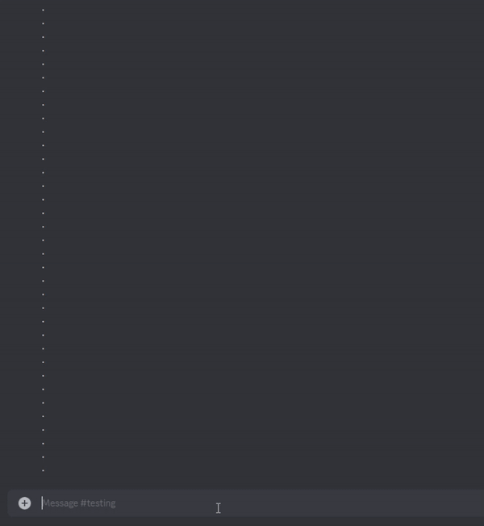
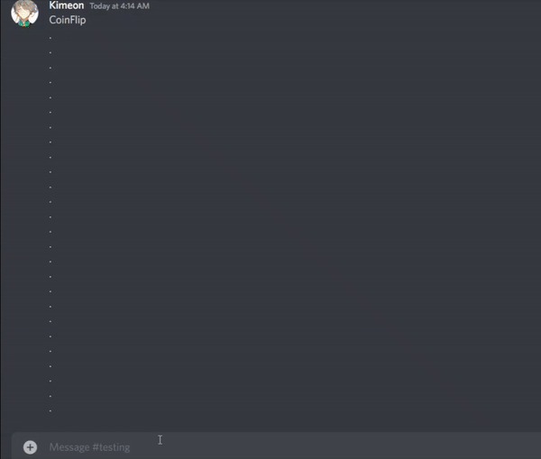
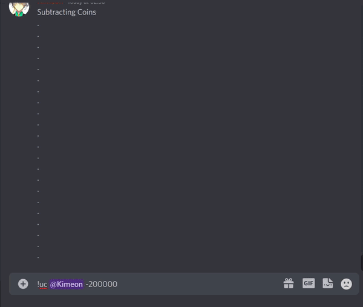
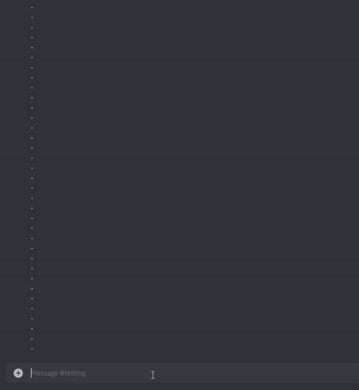
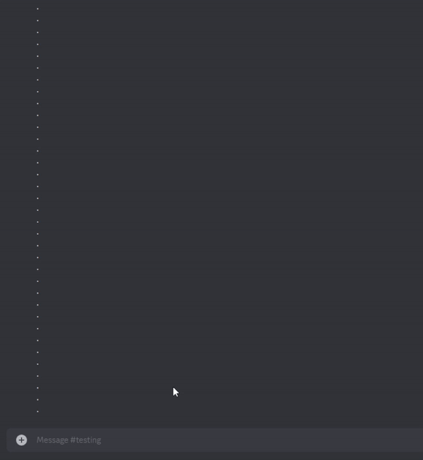
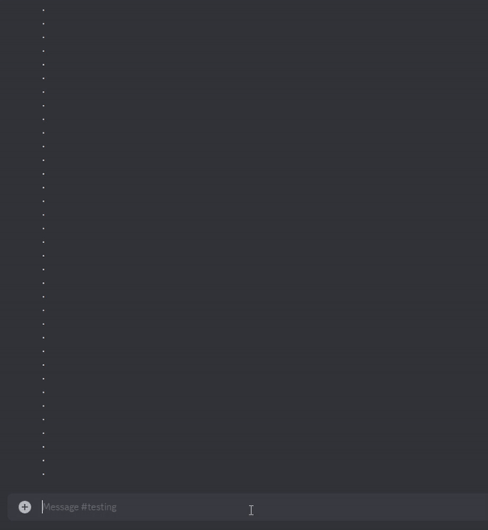
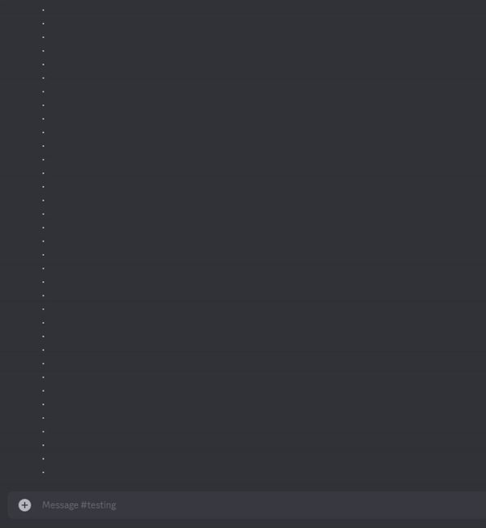
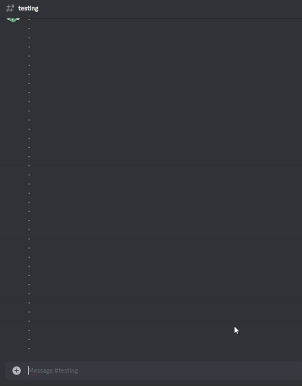
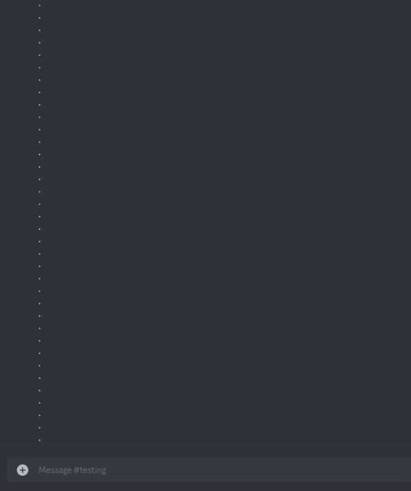

 
  

<h1 align="center"> Kuro - Discord Bot </h1>
<h3 align="center"> Discord Bot </h3>

<h4 align="center"> Try it out in my Discord server -

</h4>

<h2 id="table-of-contents"> :book: Table of Contents</h2>

  
Table of Contents

  <ol>
    <li><a href="#about-kuro"> 
    ➤ About Kuro</a></li>
    <li><a href="#getting-started"> 
    ➤ Getting Started</a></li>
    <li><a href="#demonstration"> 
    ➤ Demonstration </a>
    <ol type="i">
        <li><a href="#mini-games"> 
    ➤ MiniGames</a></li>
        <li><a href="#music-cmds"> 
    ➤ Music Commands</a></li>
    <li><a href="#lvl-and-economy"> 
    ➤ Leveling and Economy System</a></li>
      <li><a href="#enter-cmds">
    ➤ Entertainment Commands</a></li>
      <li><a href="#general-cmds"> 
    ➤ General Commands</a></li>
    </ol>
    </li>
    <li><a href="#credits">
    ➤ Credits</a></li>

  </ol>

<h2 id="about-kuro"> :pencil: About Kuro</h2>

  A Discord bot made using <a href="https://discordpy.readthedocs.io/en/stable/">discordpy</a>  API with the database managed through MongoDB.

- Has over 50+ available commands and functions.
- Contains many elaborate features that provides entertainment to server members through games, social media posts, and music.
- Has a series of games that revolve around the user deciphering the password through mind teasing challenges, as well as more sophisticated games like Blackjack.
- Enables users to create specific settings to generate random social media posts from Reddit.
- Streams copyright-free songs from YouTube and Spotify on any Discord server through voice channels.
- Many more practical and miscellaneous commands.

<h2 id="getting-started"> :book: Getting Started</h2>

To try out all the available commands, go to the discord server and enter any text channel. Begin testing any desired commands by following the specified format for each. Make sure to put in the correct amount of parameters.
 
 

To view all commands use help like this:
<pre><code>!help [command_name]</code></pre>
 - Gives a list of commands and if mentioned 'command_name' then it gives additional information on that command .

 

Type the following command to start a blackjack game:
<ul>
<li>
<pre><code>!blackjack [@mention_members]</code></pre>
 - Begins a game of blackjack with specified members.

</li>
 
 <li>
<pre><code>!vc [@member]</code></pre>
 - Displays the coin balance of mentioned member and if not mentioned any then displays owns balance
 
  Aliases: view_coins
 </li>
 <i>*aliases are alternate command names which can be used for the same purpose</i>
</ul>

<h1 id="demonstration"> :movie_camera: Demonstrations</h1>

<h2 id="mini-games">Mini-games</h2>

- Over a dozen mini-games to play.
- Wide range of difficulties and genres (e.g easy games like tic-tac-toe, harder memory games like “Crack the Code”).
- Can be played single player, multiplayer, or against Kuro.
- Players earn coins for winning mini-games.
- Players can earn special achievements by completing games.
   

 
<h3>Blackjack</h3>

 
  Blackjack is a card game played using a standard deck of cards against the dealer to see who can get the closest to 21 without going over. Players are dealt 2 cards to begin with and can choose to add more cards (hit) or don't add any cards and end their turn (stay). If the player has a higher total than the dealer, or got Blackjack (21), then they win the round.

 

 

<h4>Blackjack Demo with Ace cards</h4>

 

 

<h3>Redhack</h3>

 
In this game, there will be quadrants with numbers on them that will change into images with different colours, shapes and numbers within that quadrant. There will be questions asked about each quadrant, and players must answer using what they see.
  

 

<h3>Greenhack</h3>

 
There will be a colour sequence to memorise, when prompted, react to the embed with the colours in the correct order.

 

 <i>gif has been sped up</i>

 

 

<h3>Crack The Code (Blackhack)</h3>

 
Use the given hints and number sequences to find out the correct code.
  

 

 <i>gif has been sped up</i>

 

 <i>gif has been sped up</i>

 

 <i>gif has been sped up</i>

<h3>Decryption (Purplehack)</h3>

 
Players have to match pairs of the same emojis as shown in the grid, then send the pairs one by one. 

  

 

 

  
<h3>IP Decryptor (Yellowhack)</h3>

 
Players have to find the given sequence in the grid and send all of its coordinates together. The numbers will be constantly moving, so players must predict the future location the sequence will land on.

  

 

 

<h3>Bluehack</h3>

 
Players have to memorise the long number sequence shown, type it out, and send it back.
  

 

 

<h3>Lock Pick</h3>

 
React to the embed when the green slider comes into the red section to win.

 

 

<h3>Thermite</h3>

 
Players have to remember the location of green blocks in a grid, and when prompted, they must repeat where each green block is in the grid by sending coordinates one at a time.

 

 

<h3>Tic-Tac-Toe</h3>

 
Players can play Tic Tac Toe against another player or with Kuro by using numbers 1-9 to indicate which spaces they would like to claim.

<h4>With Kuro</h4> 

 

 

<h4>With Other Player</h4> 

 

<h3>Guess The Number</h3>

 
In this game, the player will have to guess a number between the given range. They can select 1 of 4 difficulties. The higher the difficulty level, the wider the range is.

  

 

 

<h3>Guess Kuro</h3>

 
In this game, kuro will guess player's number using binary search. The player will say high or low to kuro's guess and kuro will guess accordingly.
  

 

 

<h3>Russian Roulette</h3>

 
In this game, the player will bet if gun will be empty or not and kuro will fire the round. If player survives then next round gets more risky and rewarding.

  

 

 

<h3>Toss the coin</h3>
  

 

 

<h2 id="music-cmds">Music Commands</h2>

- When users join a voice channel they can play songs, create playlists, view information about songs through embeds, etc.
- Play songs from YouTube and Spotify links in the voice channels.

 

<h3>Play</h3>

 
When the user mentions a song title or link, Kuro will search YouTube to find the most relevant song and play it. Links can be provided from YouTube and Spotify.
  

  

 

 

<h3>Pause</h3>

 
Pauses the current song that is playing.
  

  

 

 

<h3>Resume</h3>

 
Resumes the current song that is playing.
  

  

 

 

<h3>Queue</h3>

 
When a song is currently being played, and another play command is made, that song will be queued up. 
  

  

 

 

<h3>Queue List</h3>

 
Shows the list of songs that are currently in queue. 
  

  

 

 

<h3>Remove From List</h3>

 
Players can remove songs from the list by specifying to remove and the number the song is placed in the queue.
  

 

 

<h3>Skip/Stop</h3>

 
Skips or stops the current song that is playing, and moves onto the next song that is queued.

 

 

<h3>Loop/Stop Loop</h3>

 
Loops the current song that is playing or stops the current song that is in loop.
  

 

 

 

 

<h3>Embed</h3>

 
Shows the available information about the current song playing. Information contains no. of view, likes, dislikes, duration of song, link of video and its genre, and album it was from if pulled from Spotify.
  

 

 

<h3>Leave</h3>

 
Stops the current song, any songs in queue, and Kuro leaves the voice channel.
  

 

 

<h3>Create/View/Remove Playlist</h3>

 
Users can make their own playlists that will be stored in the system and played using the “Play” command. These playlists can also be viewed or removed at any time.
  

 

 

<h3>Add Songs</h3>

 
Users can add songs to their playlists by specifying the playlist they want to add to using a list of songs or links.

 

 

<h2 id="lvl-and-economy">Leveling and Economy System</h2>

- This is a server wide economy system that tracks server members' activity through XP. 
- Members can 'level up' by getting enough experience by participating in minigames, chatting, and reacting to messages.
-  Leveling up gives members coins which they can spend on games or buying rewards in the server. As members increase their level, they also contribute to what their rank is in the server.

 

<h3>Rank</h3>

 
Shows the user’s stats throughout the whole server. This includes the total messages sent, reactions, level, rank among all members, total XP, and a progress bar to show how much XP to reach to the next level.

 

 

<h3>Add Coins</h3>

 
Adds the amount of credits mentioned into the balance of a specific player. 

 

 

<h3>Deduct Coins</h3>

 
Subtracts the amount of credits mentioned into the balance of a specific player. 

 

 

<h3>View Coin Balance</h3>

 
Allows anyone to view the amount of credits a specific player has in the system

 

 

<h2 id="enter-cmds">Entertainment Commands</h2>

- "Help” command to provide information on everything available.
- Useful commands to aid users with functionality.
- Adjust internal settings to games, view ranks/levels, economy system.
- Fun commands for entertainment (e.g view Reddit posts, ask for jokes).

 

<h3>Reddit</h3>

 
Kuro will pull a post from any subreddit page and create an embed that will lead to the Rreddit post. 

  

 

 

<h3>Reddit Loop/Stop Loop</h3>

 
Kuro will continuously pull posts from any subreddit and post them in the channel until told to stop.
  

 

 

<h3>Riddle Me This</h3>

 
Kuro will give the user a riddle to answer, and if they get it correct they win nothing, and if they get it wrong Kuro will say the correct answer.
  

 

 

<h3>Joke</h3>

 
Kuro will tell a joke from a curated list of dad jokes, and also really creative ones.
  

 

 

<h3>Knock Knock Jokes</h3>

 
Kuro knocks on the door and responds with a word. Then she hits the user with the punchline and proceeds to laugh at the user’s disappointment.
  

  

 

 

 
<h3>Dance</h3>

 
Kuro will send a random GIF of a dancing character, usually from an anime.

 

 

<h2 id="general-cmds">General Commands</h2>

 
Variety of basic commands that don't categorize with specific functions, but can be used in any situation or anytime.

 

<h3>Hello</h3>

 
When the command is used, Kuro greets back with "Hey [User]! What do you need?”

  

 

 

<h3>Choose</h3>

 
Kuro will ask what options she has to choose from, and when given options separated by commas e.g (sugar, salt, pepper), she will pick one of the options at random.

  

 

 

<h3>Repeat</h3>

 
Kuro will repeat anything the user says, e.g (!repeat Cookies are the best!).

 

 

Repeat in another channel

 

 

<h3>Direct Message</h3>

 
Kuro will become the user’s personal messenger and send DMs to anyone in the server, e.g (!dm @Kimeon Hello! :D)

  

 

 

  
<h3>Text to Speech</h3>

 
Kuro will speak any message written using the command to everyone in the channel it was posted in.

  

 

 

<h2 id="credits"> :scroll: Credits</h2>

Rajat Chaudhari (Kimeon)

